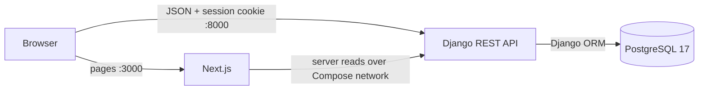

# Turbo Notes

Turbo Notes is a private, responsive notes application built for Turbo AI's Senior Full Stack Engineer challenge. The repository combines a Next.js frontend, a Django REST API, and PostgreSQL in one Docker-based monorepo. The implementation follows a spec-driven workflow: source material was converted into traceable requirements, those requirements became delivery and quality gates, and each vertical slice was verified before the next one was added.

## Product at a glance

- Email/password registration, login, session persistence, protected routes, and logout.
- Private user-scoped notes with four seeded categories and category counts.
- Responsive empty and populated dashboards inspired by the supplied Figma and video.
- Plain-text editing with a 650 ms debounced, serialized autosave queue, retry feedback, and close-time flushing.
- URL-backed category filters, debounced search, and deterministic date/category sorting.
- Server-rendered 12-note pages with automatic infinite loading, accessible retry/fallback controls, and an accurate filtered total.
- One warm, rounded scrollbar treatment across page, horizontal navigation, editor, dropdown, and dialog overflow.
- Accessible manual ordering with pointer, touch, keyboard controls, announcements, optimistic updates, and rollback.
- Reversible soft deletion with confirmation and an eight-second Undo window.
- Human-readable dates, long-text wrapping, route-specific skeletons, reduced-motion support, and Axe-checked accessibility.
- A minimal public landing page and Figma-aligned registration and login screens.

Selected enhancements were added only after the complete required journey was stable: deletion with undo, search and sorting, the landing page, accessible manual ordering, and restrained motion. Pinning, keyboard shortcuts, a trash-management screen, and deployment remain intentionally out of scope.

## Technology

| Layer | Main choices |
| --- | --- |
| Frontend | Next.js 16 App Router, React 19, TypeScript, Tailwind CSS 4, customized source-owned shadcn/ui components, Motion, dnd kit |
| Backend | Python 3.13, Django 6, Django REST Framework 3.17, Django sessions and CSRF |
| Data | PostgreSQL 17, Django ORM, migrations, deterministic indexes |
| Testing | pytest, pytest-cov, Vitest, Testing Library, Playwright, Axe |
| Tooling | Docker Compose, Make, Ruff, ESLint, Prettier, TypeScript, GitHub Actions |

## Architecture



The frontend uses React Server Components for route-level reads and small Client Component boundaries for forms, search, progressive loading, drag-and-drop, and the editor. The first ordinary note page is rendered on the server; later 12-note pages load in the browser as the user approaches the grid end. Server reads forward the Django session cookie through the internal Docker URL; browser mutations use the public API URL, include credentials, and attach Django's CSRF token. The API applies authentication and ownership before every note lookup and is the only service with database access.

The backend is split by domain instead of technical layer alone: `accounts` owns the custom email user and session endpoints, `notes` owns persistence and note workflows, and `core` owns operational concerns and the normalized error contract. Non-trivial reorder behavior lives in a transaction-aware service rather than in a view.

See [Architecture](docs/architecture.md) for request paths, data constraints, critical workflows, and trade-offs.

## Repository structure

```text
.
├── apps/
│   ├── api/                  # Django project and domain apps
│   └── web/                  # Next.js App Router application and browser tests
├── docs/                     # Public product and engineering specifications
├── .env.example              # Documented local environment contract
├── .github/workflows/ci.yml  # Dockerized quality gate
├── AGENTS.md                 # Repository-wide engineering and AI rules
├── docker-compose.yml
└── Makefile
```

## Run locally

### Prerequisites

- Docker Desktop with Docker Compose v2
- `make`

### Start the stack

```bash
cp .env.example .env
make up
```

The `api` container applies pending migrations before starting. Compose waits for PostgreSQL to become healthy before Django starts, then waits for Django before starting Next.js.

| Service | Local address | Purpose |
| --- | --- | --- |
| Next.js | [http://localhost:3000](http://localhost:3000) | Product UI |
| Django API | [http://localhost:8000/api/v1/health/](http://localhost:8000/api/v1/health/) | Versioned API and readiness check |
| Django admin | [http://localhost:8000/admin/](http://localhost:8000/admin/) | Local administration |
| PostgreSQL | `localhost:5432` | Local database connection |

Stop the containers without deleting database data:

```bash
make down
```

PostgreSQL data is stored in the named `postgres_data` volume.

### Prepare demo data

The repository does not commit database data or a prebuilt user. With the stack
running, create the documented local-only walkthrough account:

```bash
docker compose exec api python manage.py seed_demo \
  --email demo@example.com \
  --password 'TurboNotesDemo2026!'
```

| Field | Local demo value |
| --- | --- |
| Email | `demo@example.com` |
| Password | `TurboNotesDemo2026!` |

The password is intentionally public because this account exists only in the
developer's local PostgreSQL volume. Never reuse it for a real account or a
non-local environment. The command creates 24 deterministic notes—six per
category—so the first 12-note API page can load a second page through infinite
scroll while filters, ordering, category counts, and long card layouts remain
easy to review. It is idempotent: running it again refreshes the password,
preserves the sample notes, and restores any deleted sample.

To choose a different email and enter a private password interactively instead:

```bash
make seed-demo DEMO_EMAIL=demo@example.com
```

The automated browser suite creates disposable
`playwright-<uuid>@example.com` accounts. Their random emails are not stable
manual-review credentials, so use the documented demo account for the
walkthrough.

## Commands

| Command | Purpose |
| --- | --- |
| `make bootstrap` | Create `.env` when absent and build the images. |
| `make up` | Build and start PostgreSQL, Django, and Next.js. |
| `make down` | Stop the stack while preserving database data. |
| `make logs` | Follow logs from all services. |
| `make ps` | Show container and health status. |
| `make seed-demo` | Seed the idempotent local walkthrough account. |
| `make lint` | Run Prettier, ESLint, TypeScript, Ruff format, and Ruff lint checks. |
| `make test` | Run frontend and backend suites with enforced coverage. |
| `make e2e` | Run the real browser journey in the Playwright container. |
| `make audit` | Audit production frontend dependencies. |
| `make build` | Produce the Next.js production build. |
| `make check` | Run audit, lint, unit/integration tests, and production build. |

Run both `make check` and `make e2e` for the complete local gate. CI runs the same two Dockerized targets.

## Environment contract

Copy `.env.example` to `.env`; the real file is ignored. The committed defaults are local-only and must not be reused in another environment.

| Variable | Consumer | Meaning |
| --- | --- | --- |
| `POSTGRES_DB` | PostgreSQL, Compose | Database name. |
| `POSTGRES_USER` | PostgreSQL, Compose | Database user. |
| `POSTGRES_PASSWORD` | PostgreSQL, Compose | Local database password. |
| `POSTGRES_PORT` | Compose | Host port mapped to container port 5432. |
| `DATABASE_URL` | Django | Complete PostgreSQL connection string; Compose targets host `db`. |
| `DJANGO_SECRET_KEY` | Django | Session and signing secret. |
| `DJANGO_DEBUG` | Django | Local debug behavior. |
| `DJANGO_ALLOWED_HOSTS` | Django | Comma-separated accepted hosts. |
| `DJANGO_CORS_ALLOWED_ORIGINS` | Django | Frontend origins allowed to call the API. |
| `DJANGO_CSRF_TRUSTED_ORIGINS` | Django | Trusted origins for unsafe session requests. |
| `NEXT_PUBLIC_API_URL` | Browser | Public versioned API URL; bundled into client code. |
| `API_INTERNAL_URL` | Next.js server | API URL on the private Compose network. |

For non-local use, production servers, HTTPS termination, managed secrets, allowed origins, backups, observability, and deployment automation still need to be selected explicitly.

## Quality evidence

The final runtime was rebuilt and exercised from a separate clean local clone as well as the development checkout.

| Gate | Verified result |
| --- | --- |
| Static and build gate | Prettier, ESLint, TypeScript, Ruff, and the Next.js production build passed; production npm audit reported zero vulnerabilities. |
| Frontend tests | 46 passed; 95.34% statements, 87.92% branches, 94.73% functions, 97.11% lines. |
| Backend tests | 26 passed; 97.47% coverage, including authorization, CSRF, pagination, reorder rollback, and seed behavior. |
| Browser tests | 5/5 Playwright projects passed at 1440, 820, 650, 480, and 390 px with Axe scans; they verify shared control geometry, horizontal/global scrollbar contracts, and progressive 12-to-13 note loading, while the smallest viewport also verifies reduced motion. |
| Clean-clone smoke test | Fresh images built from lockfiles; `db`, `api`, and `web` became healthy; UI and API health returned HTTP 200. |

The test strategy focuses on observable risk rather than coverage alone: ownership isolation, validation failures, anonymous and authenticated CSRF, autosave sequencing, optimistic rollback, URL-state composition, responsive geometry, accessibility, and the complete user journey.

## Engineering decisions

- **Session authentication over JWT:** this is one first-party browser client, so Django sessions keep credential and session lifecycle centralized without adding token storage and rotation.
- **Server reads and client writes:** App Router pages fetch private data on the server, while interactive mutations use one typed client transport with credentials, CSRF, and a normalized `ApiError`.
- **Server-first progressive lists:** ordinary sorts render the first page in the Server Component and extend it through a small infinite-grid Client Component; manual ordering intentionally retains the complete collection because its transaction validates one exact global set.
- **Source-owned shadcn/ui:** only required primitives were added; every visible control starts from a repository-owned shadcn component and is styled through semantic design tokens and controlled variants.
- **Simple search before infrastructure:** case-insensitive PostgreSQL queries are sufficient for the challenge dataset; no search service is introduced without scale evidence.
- **Soft deletion before permanent deletion:** Undo protects the high-risk action without requiring a complete trash product.
- **Atomic global manual order:** the API locks and validates the complete active set, then updates positions without changing content timestamps.
- **Reliable autosave:** drafts remain local, requests are debounced and serialized, stale responses cannot silently overwrite newer drafts, and close/delete flush pending state.
- **KISS and SOLID at actual boundaries:** HTTP, domains, stateful interactions, and database transactions have explicit owners; no speculative abstraction layer wraps Django or React primitives.

## Development process

### 1. Discovery and specification

The challenge brief, public Figma design/prototype, and full reference video were reviewed before product code was written. Codex helped turn those sources into functional and non-functional requirements, acceptance criteria, visual tokens, open questions, and P0/P1/P2 priorities. Evidence-backed requirements were kept separate from inferred enhancements so optional creativity could not displace the required workflow.

### 2. Architecture and executable setup

The documented constraints and evaluation criteria drove the choice of a Dockerized monorepo with Next.js, Django REST Framework, and PostgreSQL. The specification was refined into architecture, environment, contribution, delivery, design-system, and quality documents before the first major implementation loop. This made the repository itself the durable prompt: the agent could reread stable decisions instead of relying only on chat history.

### 3. Quality gates before scale-up

The critical behaviors became explicit gates: authentication, ownership, CSRF, persistence, autosave, responsive layouts, errors, accessibility, and production builds. Backend API tests, frontend component tests, Playwright journeys, coverage thresholds, linting, auditing, and Docker health checks were added alongside features rather than postponed to the end.

### 4. Vertical implementation loop

Work progressed in coherent commits: repository rules and infrastructure, session authentication, the user-scoped notes domain, dashboard, editor/autosave, the complete P0 E2E gate, and then selected P1 improvements. The commit history is intentionally granular enough to show decisions and completed milestones. Its timestamps are evidence of workflow sequencing, not a claim of exact human labor time.

Codex acted as both assistant and code executor during the larger implementation run, which allowed the candidate to work on other responsibilities in parallel while retaining review and product ownership. A multi-hour gap in the history separates that run from the later visual iterations because the candidate had to step away; the subsequent commits show the human-guided QA and refinement cycle.

### 5. QA and refinement

The final phase repeatedly exercised the real application and compared it with the source material at desktop, tablet, and mobile sizes. It produced technical, functional, and visual corrections including stricter CSRF handling, hydration-safe dates, shadcn control boundaries, shared 44-pixel dashboard controls, long-word wrapping, responsive density, skeleton geometry, progressive list loading, authentic view-specific artwork, transparent assets, selector proportions, metadata, and accessibility-safe motion.

## How AI was used

OpenAI Codex was the primary AI environment. The work switched between Codex's Luna and Sol model profiles and adjusted reasoning effort to match the task: faster passes for bounded mechanical work and deeper reasoning for architecture, asynchronous state, security, debugging, and final QA. Plan mode was used to decompose and review the work; Goal mode was used for persistent, outcome-oriented implementation and verification loops.

AI contributed to:

- extracting and documenting requirements from the written brief, Figma, prototype, and 3:52 video;
- inspecting design layers and previews, identifying tokens, and exporting available source artwork;
- attempting structured Figma MCP context/variable extraction and documenting the integration's edit-access limitation;
- proposing and implementing the monorepo, Docker, PostgreSQL, API, App Router, design-system, and testing structure;
- researching current primary documentation for Next.js, Django/DRF, shadcn/ui, Motion, dnd kit, and Playwright;
- implementing vertical slices and creating tests from the documented acceptance criteria;
- controlling a browser for visual comparison, responsive checks, interaction QA, and runtime debugging;
- generating original fallback artwork only when the required source asset could not be exported;
- auditing dependencies, running Dockerized gates, reviewing diffs, and maintaining meaningful Conventional Commit history.

Skills and integrations were selected by task rather than applied indiscriminately: Figma and browser tooling supported source inspection, frontend and App Router guidance informed implementation, and terminal/Git/Docker tooling supplied reproducible verification. Exact source exports are distinguished from estimates and generated assets.

AI output was never treated as authoritative. The candidate defined priorities, challenged visual and product decisions, reviewed results, requested iterative corrections, and remains responsible for understanding and presenting the code. This workflow demonstrates AI as leverage: it accelerates research, execution, and repetitive verification while human judgment owns scope, quality, and the final result.

## Documentation

- [Requirements](docs/requirements.md): sources, priorities, acceptance criteria, exclusions, and open questions.
- [Architecture](docs/architecture.md): runtime boundaries, request paths, data model, workflows, security, and trade-offs.
- [Design system](docs/design-system.md): Tailwind v4 token contract, component policy, and source confidence.
- [Delivery plan](docs/delivery-plan.md): timeboxed milestones and enhancement order.
- [Evaluation strategy](docs/evaluation-strategy.md): challenge criteria, gates, evidence, and go/no-go rules.
- [Quality strategy](docs/quality-strategy.md): code principles, test matrix, coverage policy, and review gate.
- [Engineering rules](AGENTS.md): code, Git, security, frontend, backend, documentation, and AI rules.

Candidate-only study notes and recording aids are deliberately stored in a Git-ignored local directory and are not part of the public deliverable.

## Source material

- [Challenge Figma file](https://www.figma.com/design/nIqpRyEWKPYqYsW7RMfi3S/Notes-Taking-App-Challenge)
- [Interactive Figma prototype](https://www.figma.com/proto/nIqpRyEWKPYqYsW7RMfi3S/Notes-Taking-App-Challenge?node-id=1-2&p=f&m=dev&scaling=scale-down&content-scaling=fixed&page-id=0%3A1&starting-point-node-id=34%3A889&show-proto-sidebar=1)
- [Reference walkthrough video](https://drive.google.com/file/d/1yexyRO8qCElTYBFR9wrJCfZsqsBcTZgQ/view)

## Submission boundary

This repository is ready for local review. Publishing it to a public GitHub repository, uploading the candidate's five-minute English walkthrough, and submitting both links through Turbo AI's form are intentionally candidate-owned external actions. Before submission, verify every public link from a signed-out browser and confirm that no local `.env`, candidate notes, credentials, or generated test artifacts are tracked.
