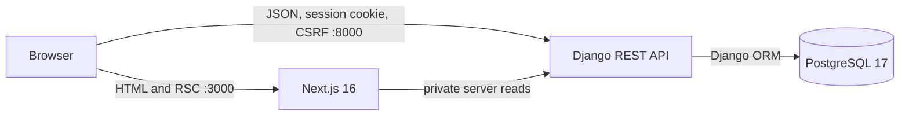

# Architecture

## Purpose and constraints

Turbo Notes is a local-first challenge application, not a production deployment. Its architecture optimizes for a complete, secure, reviewable vertical slice within a short timebox:

- explicit frontend, API, and database boundaries;
- reproducible local setup through Docker Compose;
- server-owned authentication and authorization;
- a small domain model with deterministic behavior;
- tests at the boundary where each failure is most visible;
- no speculative services or abstractions without a requirement.

## Runtime context



Docker Compose supplies a private network, persistent database volume, service health checks, and dependency ordering. The browser uses `NEXT_PUBLIC_API_URL`; Next.js server code uses `API_INTERNAL_URL`; only Django connects to PostgreSQL.

## Request paths

### Route-level read

1. The browser requests a Next.js route.
2. A Server Component reads the incoming cookie store.
3. `src/lib/api/server.ts` forwards the `Cookie` header to Django over `http://api:8000/api/v1`.
4. Django authenticates the session, scopes the queryset to `request.user`, and returns JSON.
5. Next.js renders the initial result without exposing an API credential to client JavaScript.

Every private server fetch uses `cache: "no-store"`; a user's notes are never reused as shared route cache.

### Interactive mutation

1. A Client Component calls the typed transport in `src/lib/api/client.ts`.
2. The transport includes browser credentials and obtains Django's CSRF cookie when needed.
3. Unsafe requests attach `X-CSRFToken` and use the browser-facing API URL.
4. Non-success responses become one consistent `ApiError` with status, code, message, and field errors.
5. The feature reconciles local state or refreshes the relevant Server Component route.

This split keeps server rendering simple while centralizing mutation security and error translation.

## Monorepo boundaries

### Frontend: `apps/web`

```text
src/
├── app/
│   ├── (auth)/               # Login and registration routes
│   ├── (notes)/notes/        # Protected dashboard and editor routes
│   ├── layout.tsx            # Metadata, fonts, global providers
│   └── page.tsx              # Public landing
├── components/
│   ├── auth/                 # Authentication compositions
│   ├── brand/                # Reusable product mark
│   ├── notes/                # Notes feature components
│   └── ui/                   # Source-owned shadcn primitives
└── lib/
    ├── api/                  # Server/client transports and contracts
    ├── category-theme.ts     # Semantic category mapping
    ├── format-date.ts        # Stable human-readable dates
    └── notes-query.ts        # Canonical URL query state
```

React Server Components own route guards and initial data. Client Components are limited to forms, debounced search, drag-and-drop, browser APIs, and editor state. All visible form controls are based on local shadcn/ui files rather than native one-off implementations. Tailwind CSS 4 semantic tokens and controlled component variants hold reusable cosmetics; layouts compose those primitives without duplicating a shadow design system.

### Backend: `apps/api`

```text
apps/api/
├── config/                   # Settings and root URL configuration
├── accounts/                 # Custom user and session API
├── notes/                    # Models, serializers, views, services, tests
├── core/                     # Health endpoint and error contract
└── scripts/start.sh          # Migrate then start local server
```

Views translate HTTP, serializers validate payloads, querysets enforce ownership, and `notes/services.py` contains the transaction-sensitive reorder operation. The separation is intentionally shallow: Django and DRF already provide the repository, validation, and routing abstractions needed by this scope.

## Domain model

### User

The project created a custom user model before product migrations. Email is the unique login identifier; Django owns password hashing, validators, session creation, and session invalidation.

### Category

| Field | Constraint | Purpose |
| --- | --- | --- |
| `name` | 50 characters | Visible label. |
| `slug` | unique | Stable API and URL value. |
| `color_key` | enum | Maps API data to approved UI tokens. |
| `sort_order` | unique positive integer | Stable navigation and category ordering. |

The four design categories are inserted through a data migration, so API views and React components do not duplicate the list.

### Note

| Field | Constraint | Purpose |
| --- | --- | --- |
| `id` | UUID primary key | Non-sequential public identity. |
| `owner` | required user foreign key, cascade | Authorization boundary. |
| `category` | required protected foreign key | Stable visual classification. |
| `title` | up to 120 characters, blank allowed | Plain-text title. |
| `content` | API limit of 10,000 characters | Plain text with line breaks. |
| `manual_order` | positive integer | Global order for active owner notes. |
| `deleted_at` | nullable timestamp | Reversible deletion. |
| `created_at`, `updated_at` | server-controlled UTC | History and deterministic ordering. |

Indexes support owner/date, owner/category/date, and owner/manual-order access paths.

## API contract

All product routes are versioned under `/api/v1/`.

| Method | Route | Behavior |
| --- | --- | --- |
| `GET` | `/health/` | Checks API and database readiness. |
| `GET` | `/auth/csrf/` | Issues or refreshes the CSRF cookie. |
| `POST` | `/auth/register/` | Creates an account and authenticated session. |
| `POST` | `/auth/login/` | Authenticates an existing account. |
| `POST` | `/auth/logout/` | Invalidates the session. |
| `GET` | `/auth/me/` | Returns the current identity. |
| `GET` | `/categories/` | Returns stable categories with owner-scoped active-note counts. |
| `GET`, `POST` | `/notes/` | Lists scoped notes or creates a note. |
| `GET`, `PATCH`, `DELETE` | `/notes/{id}/` | Reads, edits, or soft-deletes an owned active note. |
| `POST` | `/notes/{id}/restore/` | Restores an owned deleted note. |
| `POST` | `/notes/reorder/` | Atomically persists the complete active-note order. |

The note list accepts `category`, `q`, and `ordering`. Ordering is allowlisted to `-updated_at`, `updated_at`, `category`, or `manual`; manual order rejects category/search filters because the domain stores one global position per active note.

## Critical workflows

### Authentication, ownership, and CSRF

- Django sessions are appropriate for one first-party web client and avoid unnecessary JWT storage and rotation.
- Browser calls include credentials; CORS and trusted origins are explicit environment values.
- Django REST Framework protects authenticated unsafe requests. A custom permission also enforces CSRF on anonymous registration and login before a session exists.
- Every normal and restore queryset includes the authenticated owner before object lookup, so another user's UUID behaves as not found.
- API errors do not reveal which credential field was correct.

### Autosave

1. Title, content, and category change in a local draft.
2. A signature marks the draft dirty relative to the last accepted response.
3. A 650 ms debounce schedules a `PATCH`.
4. A promise queue serializes writes; a failed write does not poison later retries.
5. The UI exposes dirty, saving, saved, and recoverable error states.
6. Close and delete clear the timer, await the queue, and flush the latest draft before navigation.
7. `beforeunload` protects a draft that has not reached the saved state.

The deliberate conflict policy is last accepted write wins. Optimistic concurrency is deferred until there is a demonstrated multi-device editing requirement.

### Query state

Category, search, and ordering live in URL search parameters. Server rendering, refresh, browser navigation, and local link sharing therefore use one canonical state. Search is debounced in the client but executed by the API with case-insensitive title/content matching and deterministic tie-breakers.

### Reversible deletion

`DELETE` sets `deleted_at`; active list/detail querysets exclude that row. The dashboard receives the deleted UUID in its return URL and exposes Undo for eight seconds. Restore remains owner-scoped, clears `deleted_at`, assigns the last manual position, and returns the complete resource. Permanent cleanup and a trash screen are deferred.

### Manual ordering

The UI enables manual ordering only for the complete, unsearched notebook. It sends every active note UUID after a move. The service starts a database transaction, locks the owner's active set, requires exact set equality and unique IDs, then bulk-updates only `manual_order`. The client applies the move optimistically and rolls back to the last confirmed order on failure. Pointer, touch, keyboard, screen-reader instructions, and live position announcements share the same feature.

## Reliability and quality

- Backend API tests cover authentication, CSRF, validation, ownership, filtering, ordering, deletion/restore, transaction behavior, and seed idempotence.
- Frontend tests cover interactive components and pure query/date transformations without distorting Server Component boundaries.
- Playwright exercises the real user journey across five viewports and runs Axe scans.
- Coverage thresholds, formatters, linters, TypeScript, dependency auditing, builds, Docker health checks, and smoke tests form the remaining gate.
- GitHub Actions runs `make check` and `make e2e` in Docker, matching the supported local workflow.

Coverage is evidence, not the goal. Authorization, failure paths, asynchronous ordering, responsive behavior, and accessibility receive explicit assertions even when a happy-path test would increase the number faster.

## Trade-offs and deferred production work

- PostgreSQL `icontains` is intentionally sufficient for the small dataset; full-text search infrastructure is premature.
- Categories are shared seeded values; user-managed categories require new authorization, mutation, and migration rules.
- The plain-text editor follows the challenge; rich text and collaboration would materially change persistence and security.
- One global manual order keeps the model coherent; per-filter order would require a separate position entity or ordering policy.
- No background cleanup permanently deletes soft-deleted notes yet.
- Deployment is outside scope. A production milestone must choose application servers, HTTPS, managed PostgreSQL, secrets, static assets, backups, observability, cookie/domain policy, and CI/CD destinations.
