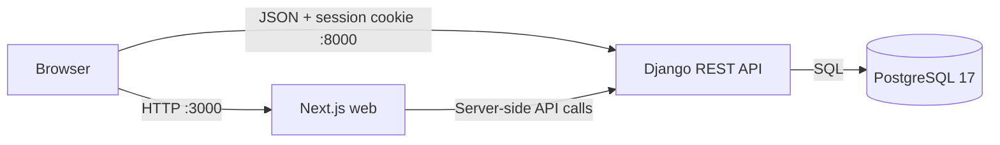

# Architecture

## Goals

- Deliver the challenge's core note workflow quickly without sacrificing authorization, tests, or maintainability.
- Keep frontend and backend boundaries explicit so each can evolve and be reviewed independently.
- Use production-shaped technology locally while postponing deployment-specific infrastructure.
- Prefer a small number of clear modules over a speculative framework inside the framework.

## System context



Docker Compose provides the local network and health ordering. The browser uses `NEXT_PUBLIC_API_URL`; Next.js server code uses `API_INTERNAL_URL`; Django is the only application that connects to PostgreSQL.

## Monorepo boundaries

### `apps/web`

- Next.js App Router and React Server Components by default.
- Client Components only for forms, filters, editor state, autosave, and browser APIs.
- Tailwind CSS v4 with CSS-first semantic tokens.
- shadcn/ui components added on demand and customized in-repository.
- Typed API modules isolate transport concerns from presentational components.

Suggested feature structure as slices are implemented:

```text
src/
├── app/
│   ├── (auth)/
│   └── (notes)/
├── components/
│   ├── notes/
│   └── ui/
├── features/
│   ├── auth/
│   └── notes/
└── lib/
    ├── api/
    └── env/
```

### `apps/api`

- Django configuration and versioned DRF routes.
- Domain apps should own models, migrations, serializers, services, URLs, and tests.
- Views handle HTTP translation; serializers validate payloads; services/model methods hold non-trivial domain decisions.
- Querysets enforce ownership before object lookup.

Suggested evolution:

```text
apps/api/
├── config/
├── core/       # Operational concerns such as health
├── accounts/   # Registration and session endpoints
└── notes/      # Categories, notes, domain services, and tests
```

## Data model direction

### User

Use Django's swappable user model contract from the first domain migration. If email is the login identifier, introduce a custom user model before product data migrations rather than changing it later.

### Category

| Field | Type | Notes |
| --- | --- | --- |
| `id` | integer or UUID | Internal identity. |
| `name` | string | Human-readable label. |
| `slug` | unique string | Stable API and UI mapping key. |
| `color_key` | constrained string | Maps to an approved frontend semantic token. |
| `sort_order` | positive integer | Deterministic navigation order. |

Categories should be seeded through a data migration. Do not hard-code the visible list in API views or React components.

### Note

| Field | Type | Notes |
| --- | --- | --- |
| `id` | UUID | Non-sequential public identifier. |
| `owner` | foreign key to user | Mandatory authorization boundary. |
| `category` | protected foreign key | Required by the reviewed editor. |
| `title` | bounded string | Plain text; whitespace normalized deliberately. |
| `content` | text | Plain text with line breaks preserved. |
| `created_at` | timestamp | UTC, server controlled. |
| `updated_at` | timestamp | UTC, drives display and ordering. |

Indexes should support `(owner, -updated_at)` and `(owner, category, -updated_at)`. Database constraints should enforce field bounds and valid relationships where practical.

## API direction

The exact contract will be finalized with the first product slice. Expected minimal routes:

| Method | Route | Purpose |
| --- | --- | --- |
| `GET` | `/api/v1/health/` | API and database readiness; implemented. |
| `POST` | `/api/v1/auth/register/` | Create an account and session. |
| `POST` | `/api/v1/auth/login/` | Authenticate credentials. |
| `POST` | `/api/v1/auth/logout/` | Invalidate the session. |
| `GET` | `/api/v1/auth/me/` | Return the current identity. |
| `GET` | `/api/v1/categories/` | Categories with current user's note counts. |
| `GET` | `/api/v1/notes/` | Current user's notes, optionally filtered by category. |
| `POST` | `/api/v1/notes/` | Create a note. |
| `GET` | `/api/v1/notes/{id}/` | Load full note content. |
| `PATCH` | `/api/v1/notes/{id}/` | Autosave changed fields. |

Do not add delete or category-write endpoints until the product scope confirms those actions.

## Authentication and CSRF

Use Django session authentication for the local web application. This keeps credentials and session lifecycle in Django, but cross-origin local development requires deliberate handling:

- browser requests include credentials;
- CORS allows only configured frontend origins;
- unsafe requests include Django's CSRF token;
- session and CSRF cookies use secure production settings before deployment;
- API errors never reveal whether a password or a particular credential field was correct.

JWT is unnecessary for the current first-party browser client and would add token storage and rotation work without a demonstrated requirement.

## Autosave strategy

1. Keep title, content, and category in local editor state.
2. Mark the editor dirty after a meaningful change.
3. Debounce `PATCH` requests for a short interval.
4. Cancel or supersede stale pending requests where possible.
5. Show `Saving`, `Saved`, or a recoverable error.
6. Flush or await a pending save before closing.

MVP conflict behavior is last accepted write wins. The API's `updated_at` response becomes the displayed “Last edited” value. Optimistic concurrency can be added later if a real multi-device requirement appears.

## Testing strategy

- **Backend unit/API tests**: model constraints, serializer validation, authentication, ownership, filtering, ordering, counts, autosave patches, and query behavior.
- **Frontend component tests**: forms, category selection, empty/error states, note previews, and autosave state transitions.
- **Integration tests**: critical authenticated workflow against API boundaries.
- **End-to-end tests**: register, create, filter, edit, reload, sign out, and authorization redirect.
- **Infrastructure smoke test**: Compose health checks plus HTTP verification of ports 3000 and 8000.

Coverage is a feedback signal, not a substitute for boundary-focused tests. The current backend threshold is 80%.

## Deferred production concerns

Deployment is intentionally out of current scope. A production milestone must select an application server, static asset strategy, HTTPS termination, managed PostgreSQL, secret storage, backups, observability, cookie policy, and CI/CD environment before release.
